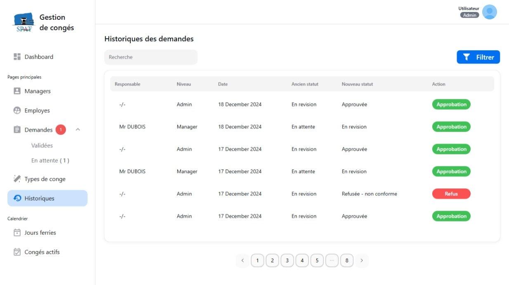

# Leave Management System

Un système complet de gestion des congés pour entreprises, basé sur **NestJS** (backend) et **Next.js** (frontend), avec **Prisma** comme ORM.

---

## 🚀 Fonctionnalités principales

- Authentification avec **JWT**
- Gestion des rôles (**Employé**, **Manager**, **Admin**)
- Demandes de congés avec suivi du statut (En attente, Approuvé, Refusé, Modifié, Annulé)
- Gestion des jours fériés
- Notifications par email (création de compte, validation de demande…)
- Tableau de bord avec graphiques et statistiques
- Choix du rôle à la connexion (si manager et employé en même temps)

---

## 🛠️ Technologies utilisées

### Backend
- [NestJS](https://nestjs.com/) (API REST + Authentification JWT)
- [Prisma](https://www.prisma.io/) (ORM + base de données)
- Nodemailer (envoi d’emails)
- BCrypt (hashing mots de passe)

### Frontend
- [Next.js](https://nextjs.org/)
- [NextUI](https://nextui.org/) pour les composants UI
- [ApexCharts](https://apexcharts.com/) pour les graphiques

---

## 🔐 Authentification & Comptes
- Un **employé** a un seul compte.
- Si son rôle est `employe` → accès direct côté employé.
- Si son rôle est `manager` → choix du mode (Manager / Employé).
- Les comptes expirés ou non confirmés sont automatiquement supprimés.

---

## 📧 Emails automatisés
- Lors de la création d’un compte → l’employé reçoit un mail avec un lien sécurisé pour définir son mot de passe.
- Le lien expire après une utilisation ou un délai défini.
- Gestion de l’envoi avec Gmail (prod) ou MailHog/smtp4dev (test).

---

## 📊 Suivi et statistiques
- Vue manager/admin :
  - Nombre de congés par type (payé, maladie, maternité, etc.)
  - Suivi des demandes (en attente, approuvées, refusées…)
  - Graphiques interactifs via ApexCharts
- Vue employé :
  - Historique personnel des demandes
  - Statut en temps réel

---

## 📷 Aperçu

